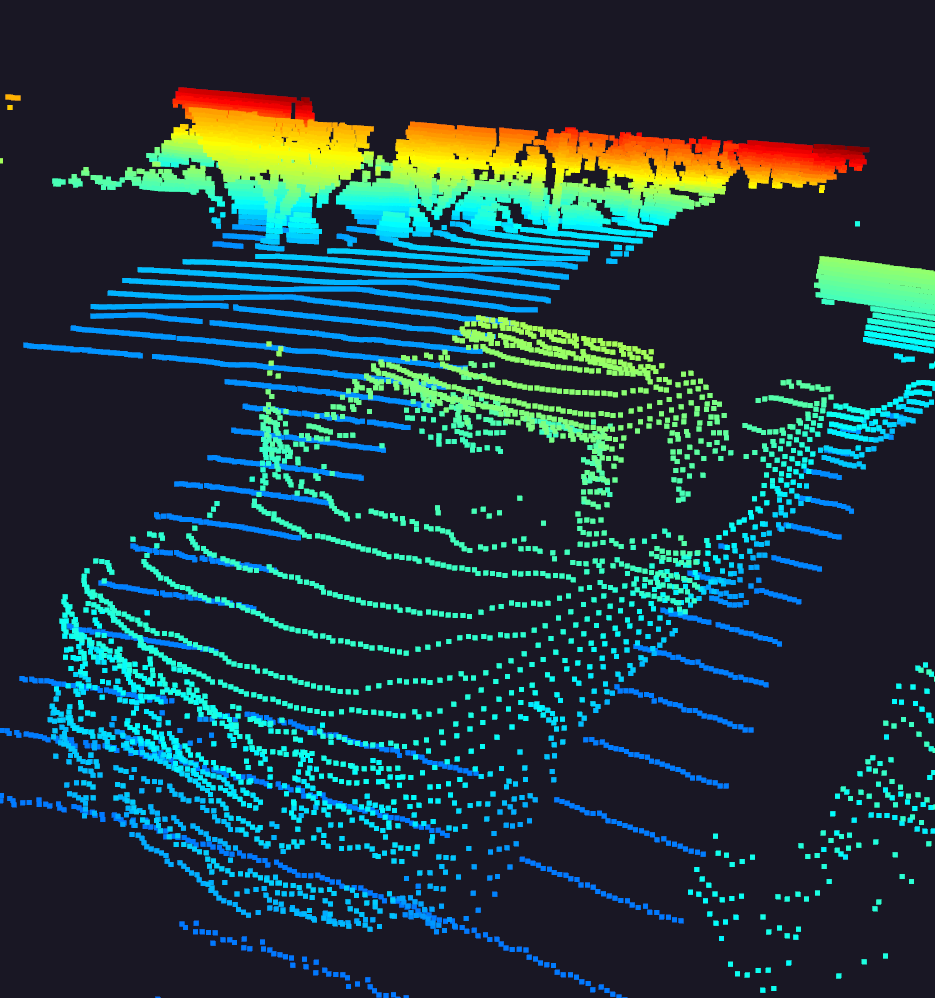

# SDCND : Sensor Fusion and Tracking

## Finals Submission


### Writeup: Track 3D-Objects Over Time

Here is a short recap of the project steps and the respective results:

The first task involved performing the tracking of a single vehicle in 3D by implementing a **Kalman Filter**. A constant velocity model was used caractherized by the following **system matrix**:

$$
\mathbf{F}(\Delta t) = \begin{pmatrix} 1 & 0 & 0 & \Delta t & 0 & 0\\ 0 & 1 & 0 & 0 & \Delta t & 0\\ 0 & 0 & 1 & 0& 0& \Delta t \\ 0 & 0 & 0 & 1 & 0& 0\\0 & 0& 0& 0& 1& 0 \\0 & 0& 0& 0& 0& 1 \end{pmatrix} 
$$

And by the following **process noise**:
$$
\mathbf{Q}(\Delta t, q)=\begin{pmatrix} \frac 1{3} \left(\Delta t\right)^3 q & 0 & 0 & \frac 1{2} \left(\Delta t\right)^2 q& 0 & 0\\ 0 & \frac 1{3} \left(\Delta t\right)^3 q& 0 & 0 & \frac 1{2} \left(\Delta t\right)^2 q & 0 \\ 0 & 0 & \frac 1{3} \left(\Delta t\right)^3 q& 0 & 0 & \frac 1{2} \left(\Delta t\right)^2 q & \\ \frac 1{2} \left(\Delta t\right)^2 q& 0 & 0 & \Delta t q& 0 & 0 \\ 0 & \frac 1{2} \left(\Delta t\right)^2 q& 0 & 0 & \Delta t q & 0 \\ 0 & 0 & \frac 1{2} \left(\Delta t\right)^2 q& 0 & 0 & \Delta t q\end{pmatrix}
$$
Where *q* is the acceleration uncertainty and is a design parameter set to $3 m/s^2$.

In this step only a single vehicle was tracked, using only the measurements from the lidar sensor.

Here are the results for this step: the RMSE result is below the expected $0.35$ threshold from the project rubric.


The second task involved implementing most of the track management algorithm. This required initializing new tracks as well managing and deleting ghost tracks. For the deletion the following **heuristic** was implemented wich delted tracks if their uncertainty grew outside of a $3m$ radius ellipsoid.

$$
\mathbf{P}_{11}> 3^2 \cup \mathbf{P}_{22}> 3^2
$$

Here are the results for this step: the RMSE result is below the expected $0.8$ threshold from the project rubric.


The third task involved implementing the **Simple Nearest Neighbour**(SNN) data association algorithm. Here is when the project became more complex because multiple vehicles are tracked simultaneusly, and debugging is more difficult. The SNN algorithm is implemented via association matrix A wich requires computing the Mahalanobis distance for each track/measure pair and associating the nearest measures to their track.

Here are the results for this step: the RMSE shows there are only 3 tracks with no extra ghost tracks as specified in the project rubric.


The final task involved improving step 3 by including camera measurements in the filter. This required including camera measurements when initializing tracks as well implementing the non-linear **measurement function** h:

$$
h(\mathbf{x}) = \large \begin{pmatrix} c_i-\frac{f_i\cdot p_y}{p_x}\\ c_j-\frac{f_j\cdot p_z}{p_x} \end{pmatrix}
$$

Where the camera calibration parameter *f* and *c* were provided.

Here are the results for the final step: the RMSE is below $0.25$ as specified in the project rubric.


The final step clearly shows that there are benefits in camera-lidar fusion: the tracking accuracy is overall increased as shown by the last two plots. Moreover in real scenarios using multiple (and even redundant) sensors can improve the safety of the self driving vehicle.

In my view one major challenge a sensor fusion system will face in real-life scenario has to be with sensor timing: we could not see in this project because curated data from WAYMO was provided, but in real-life we may encounter poorly synchronized sensors with delayed time stamps which can cause the filter to have poor results.

We could see improvements when integrating camera measurements, although the camera has a limited field of view when compared to lidar, so in my view it could be a good idea to include additional cameras to cover the blind spots of the front camera. This should allow to discard ghost tracks on the sides more quickly. An other idea could be using an IMU to estimate the current velocity of our vehicle: in the lecures it was explained that the parameters of the filter have tobe tuned depending on the current driving scenario, this way we could change them dynamically depending on the car driving speed, potentially improving the reliability of our tracking system.

## Midterm Submission

The following are some car examples gathered from the pointclouds in the dataset by setting `exec_visualization = ["show_pcl"]`:

| | Car Samples from PCL | |
|:-------------------------:|:-------------------------:|:-------------------------:|
||||
||||
||||

Some features that sand out that can be useful for object detection:
* **Aspect Ratio**: all vehicles have appear to have a similar aspect ratio, expecitally in a bev representation, including otherwise outliers such as pick up trucks.
* **Windshields**: glass does not reflect and does not cause a energy return, as such in all vehicles it appears as a "hole" in the pointcloud wich is very characteristic.
* **Side mirrors**: despite being small, they stand out quite a lot. I also suspect they create a stronger *intensity* return signal being reflective.
* **Tires** tires are easily cut-off in the top lidar due to limitied field of view, but still manage to stand out.

### Visualize range image channels (ID_S1_EX1)


### Compute intensity layer of the BEV map (ID_S2_EX2)


### Compute height layer of the BEV map (ID_S2_EX3)


### Extract 3D bounding boxes from model response (ID_S3_EX2)


### Compute precision and recall (ID_S4_EX3)
Final results are `precision = 0.9506578947368421, recall = 0.9444444444444444` with iou_treshold of 0.5


## Project File Structure

📦project<br>
 ┣ 📂dataset --> contains the Waymo Open Dataset sequences <br>
 ┃<br>
 ┣ 📂misc<br>
 ┃ ┣ evaluation.py --> plot functions for tracking visualization and RMSE calculation<br>
 ┃ ┣ helpers.py --> misc. helper functions, e.g. for loading / saving binary files<br>
 ┃ ┗ objdet_tools.py --> object detection functions without student tasks<br>
 ┃ ┗ params.py --> parameter file for the tracking part<br>
 ┃ <br>
 ┣ 📂results --> binary files with pre-computed intermediate results<br>
 ┃ <br>
 ┣ 📂student <br>
 ┃ ┣ association.py --> data association logic for assigning measurements to tracks incl. student tasks <br>
 ┃ ┣ filter.py --> extended Kalman filter implementation incl. student tasks <br>
 ┃ ┣ measurements.py --> sensor and measurement classes for camera and lidar incl. student tasks <br>
 ┃ ┣ objdet_detect.py --> model-based object detection incl. student tasks <br>
 ┃ ┣ objdet_eval.py --> performance assessment for object detection incl. student tasks <br>
 ┃ ┣ objdet_pcl.py --> point-cloud functions, e.g. for birds-eye view incl. student tasks <br>
 ┃ ┗ trackmanagement.py --> track and track management classes incl. student tasks  <br>
 ┃ <br>
 ┣ 📂tools --> external tools<br>
 ┃ ┣ 📂objdet_models --> models for object detection<br>
 ┃ ┃ ┃<br>
 ┃ ┃ ┣ 📂darknet<br>
 ┃ ┃ ┃ ┣ 📂config<br>
 ┃ ┃ ┃ ┣ 📂models --> darknet / yolo model class and tools<br>
 ┃ ┃ ┃ ┣ 📂pretrained --> copy pre-trained model file here<br>
 ┃ ┃ ┃ ┃ ┗ complex_yolov4_mse_loss.pth<br>
 ┃ ┃ ┃ ┣ 📂utils --> various helper functions<br>
 ┃ ┃ ┃<br>
 ┃ ┃ ┗ 📂resnet<br>
 ┃ ┃ ┃ ┣ 📂models --> fpn_resnet model class and tools<br>
 ┃ ┃ ┃ ┣ 📂pretrained --> copy pre-trained model file here <br>
 ┃ ┃ ┃ ┃ ┗ fpn_resnet_18_epoch_300.pth <br>
 ┃ ┃ ┃ ┣ 📂utils --> various helper functions<br>
 ┃ ┃ ┃<br>
 ┃ ┗ 📂waymo_reader --> functions for light-weight loading of Waymo sequences<br>
 ┃<br>
 ┣ basic_loop.py<br>
 ┣ loop_over_dataset.py<br>


## Installation Instructions for Running Locally
### Cloning the Project
In order to create a local copy of the project, please click on "Code" and then "Download ZIP". Alternatively, you may of-course use GitHub Desktop or Git Bash for this purpose. 

### Package Requirements
I recommend using **anaconda** to create an isolated project python environment. All dependencies required for recreating the project environment `project-dev` have been listed in the file `environment.yml`.

Create the env:
```
conda env create --file environment.yml
```

Activate the env:
```
conda activate project-dev
```

### Waymo Open Dataset Reader
The Waymo Open Dataset Reader is a very convenient toolbox that allows you to access sequences from the Waymo Open Dataset without the need of installing all of the heavy-weight dependencies that come along with the official toolbox. The installation instructions can be found in `tools/waymo_reader/README.md`. 

### Waymo Open Dataset Files
This project makes use of three different sequences to illustrate the concepts of object detection and tracking. These are: 
- Sequence 1 : `training_segment-1005081002024129653_5313_150_5333_150_with_camera_labels.tfrecord`
- Sequence 2 : `training_segment-10072231702153043603_5725_000_5745_000_with_camera_labels.tfrecord`
- Sequence 3 : `training_segment-10963653239323173269_1924_000_1944_000_with_camera_labels.tfrecord`

To download these files, you will have to register with Waymo Open Dataset first: [Open Dataset – Waymo](https://waymo.com/open/terms), if you have not already, making sure to note "Udacity" as your institution.

Once you have done so, please [click here](https://console.cloud.google.com/storage/browser/waymo_open_dataset_v_1_2_0_individual_files) to access the Google Cloud Container that holds all the sequences. Once you have been cleared for access by Waymo (which might take up to 48 hours), you can download the individual sequences. 

The sequences listed above can be found in the folder "training". Please download them and put the `tfrecord`-files into the `dataset` folder of this project.


### Pre-Trained Models
The object detection methods used in this project use pre-trained models which have been provided by the original authors. They can be downloaded [here](https://drive.google.com/file/d/1Pqx7sShlqKSGmvshTYbNDcUEYyZwfn3A/view?usp=sharing) (darknet) and [here](https://drive.google.com/file/d/1RcEfUIF1pzDZco8PJkZ10OL-wLL2usEj/view?usp=sharing) (fpn_resnet). Once downloaded, please copy the model files into the paths `/tools/objdet_models/darknet/pretrained` and `/tools/objdet_models/fpn_resnet/pretrained` respectively.

### Using Pre-Computed Results

In the main file `loop_over_dataset.py`, you can choose which steps of the algorithm should be executed. If you want to call a specific function, you simply need to add the corresponding string literal to one of the following lists: 

- `exec_data` : controls the execution of steps related to sensor data. 
  - `pcl_from_rangeimage` transforms the Waymo Open Data range image into a 3D point-cloud
  - `load_image` returns the image of the front camera

- `exec_detection` : controls which steps of model-based 3D object detection are performed
  - `bev_from_pcl` transforms the point-cloud into a fixed-size birds-eye view perspective
  - `detect_objects` executes the actual detection and returns a set of objects (only vehicles) 
  - `validate_object_labels` decides which ground-truth labels should be considered (e.g. based on difficulty or visibility)
  - `measure_detection_performance` contains methods to evaluate detection performance for a single frame

In case you do not include a specific step into the list, pre-computed binary files will be loaded instead. This enables you to run the algorithm and look at the results even without having implemented anything yet. The pre-computed results for the mid-term project need to be loaded using [this](https://drive.google.com/drive/folders/1-s46dKSrtx8rrNwnObGbly2nO3i4D7r7?usp=sharing) link. Please use the folder `darknet` first. Unzip the file within and put its content into the folder `results`.

- `exec_tracking` : controls the execution of the object tracking algorithm

- `exec_visualization` : controls the visualization of results
  - `show_range_image` displays two LiDAR range image channels (range and intensity)
  - `show_labels_in_image` projects ground-truth boxes into the front camera image
  - `show_objects_and_labels_in_bev` projects detected objects and label boxes into the birds-eye view
  - `show_objects_in_bev_labels_in_camera` displays a stacked view with labels inside the camera image on top and the birds-eye view with detected objects on the bottom
  - `show_tracks` displays the tracking results
  - `show_detection_performance` displays the performance evaluation based on all detected 
  - `make_tracking_movie` renders an output movie of the object tracking results

Even without solving any of the tasks, the project code can be executed. 

The final project uses pre-computed lidar detections in order for all students to have the same input data. If you use the workspace, the data is prepared there already. Otherwise, [download the pre-computed lidar detections](https://drive.google.com/drive/folders/1IkqFGYTF6Fh_d8J3UjQOSNJ2V42UDZpO?usp=sharing) (~1 GB), unzip them and put them in the folder `results`.

## External Dependencies
Parts of this project are based on the following repositories: 
- [Simple Waymo Open Dataset Reader](https://github.com/gdlg/simple-waymo-open-dataset-reader)
- [Super Fast and Accurate 3D Object Detection based on 3D LiDAR Point Clouds](https://github.com/maudzung/SFA3D)
- [Complex-YOLO: Real-time 3D Object Detection on Point Clouds](https://github.com/maudzung/Complex-YOLOv4-Pytorch)


## License
[License](LICENSE.md)
